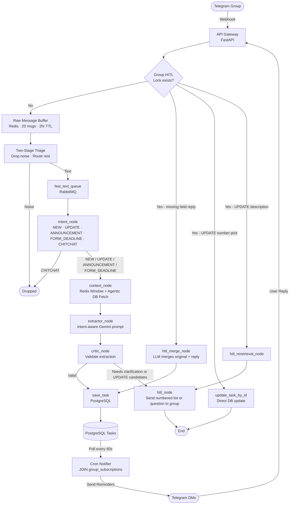

# Sieve - AI-Powered Task Assistant

**Sieve** is an distributed AI system that autonomously monitors Telegram group chats, extracts tasks and deadlines using Google Gemini, and sends intelligent private reminders.

## System Architecture



## Features

### 1. Two-Stage Triage
- Stage 1: Drops pure noise only (single emoji, "ok", "thanks") before any processing
- Stage 2: Routes everything else to queue — intent classification done by LLM, not keywords
- Every message buffered to Redis rolling window (20 msgs, 2hr TTL) before triage decision

### 2. Multi-Intent Extraction
Supports 6 message intents, each with different extraction logic:
- `NEW` — deadlines and tasks
- `UPDATE` — corrections to existing tasks, with user confirmation before any DB write
- `ANNOUNCEMENT` — venue changes, class cancellations, schedule shifts
- `FORM_DEADLINE` — Google Form links with deadlines
- `CHITCHAT` / `QUERY` — dropped without LLM cost

### 3. Agentic Context Retrieval
- LLM reads incoming message and decides what DB context it needs
- Fetches only active tasks (deadline not expired) from PostgreSQL
- Combines with Redis rolling message window for full conversation context
- Used to match UPDATE messages to correct existing tasks

### 4. UPDATE Confirmation Flow
- Every task update requires explicit user confirmation via DM
- If wrong task matched, user can reject and agent re-queries excluding rejected tasks
- Up to 2 re-retrieval rounds before graceful fallback
- No data is mutated without user confirmation

### 5. Multi-Round HITL (Human-in-the-Loop)

**Group HITL:**
Bot sends clarification to GROUP chat
"Task detected — what's the deadline? Reply to THIS message"
First valid reply wins, lock cleared

**Personal HITL:**
Bot sends clarification via PRIVATE DM
"Got it — when should I remind you? Reply to THIS message"
User replies in same private chat

- Redis lock persists state across messages (1hr TTL)
- User reply routed back through pipeline with full saved context
- Max 2 rounds, then offers to create as new task

### 6. Silent Observer UX
- Bot never replies in group chat
- All interactions via private DM only
- Non-intrusive monitoring

### 7. Multi-Modal Processing
- **Text**: LangGraph async pipeline with 7 intent types
- **Images**: Gemini Vision with correct base64 encoding
- **PDFs**: PyMuPDF OCR + LLM extraction
- Both workers save one task per group message — subscribers resolved at reminder time via JOIN

### 8. Personal Reminders via DM
- Users can DM the bot directly to set personal reminders
- "Remind me to meet my friend on Saturday 6pm"
- Saved for that user only — not shared with any group
- Same HITL flow applies — bot asks for missing info in DM

### 9. Group-Level Task Storage
- One task row per group message (not per subscriber)
- Eliminates 60x write amplification for large groups
- Subscribers resolved at reminder time via JOIN query
- 60x reduction in database storage for active groups


## Project Structure

```
Sieve/
 api_gateway/              # FastAPI webhook receiver
    core/
       config.py
    routers/
       webhook.py       # Main routing logic
    services/
       redis_client.py  # HITL lock management
       database.py      # Task persistence
       rabbitmq.py      # Queue publishing
       telegram.py      # DM sending
    main.py
    requirements.txt
    Dockerfile

 workers/
    text_extractor/      # Text message processor
       core/
       graph/           # LangGraph workflow
       nodes/           # Workflow nodes
       services/
       main.py
   
    media_extractor/     # Image/PDF processor
       core/
       graph/           # LangGraph workflow
       nodes/           # Workflow nodes
       services/
       main.py
   
    cron_notifier/       # Reminder sender
        core/
        services/
        jobs/
        main.py

 shared/
    schemas.py           # Pydantic models

 database/
    init.sql             # PostgreSQL schema

 docker-compose.yml       # Full stack orchestration
 .env.example
 README.md
```

## Tech Stack

| Component | Technology |
|-----------|------------|
| **API Gateway** | FastAPI, asyncio |
| **Message Queue** | RabbitMQ (aio_pika) |
| **Cache/HITL** | Redis (redis.asyncio) |
| **Database** | PostgreSQL (asyncpg) |
| **AI/LLM** | Google Gemini 2.5 Flash, LangGraph |
| **Vision/OCR** | Gemini 2.0 Flash, PyMuPDF |
| **Scheduler** | APScheduler |
| **HTTP Client** | httpx |

## Database Design

### Tasks Table
One row per message — either group or personal:
- `group_id` — set for group tasks, NULL for personal
- `user_id` — set for personal tasks, NULL for group
- Constraint: at least one of `user_id` or `group_id` must be set

### Reminder Strategy
- `standard` — 24hr, 1hr, deadline alerts
- `morning_of` — 7am on the day (announcements)
- `immediate` — fire right now (same-day changes)

## Quick Start

### Prerequisites
- Docker & Docker Compose
- Telegram Bot Token (from @BotFather)
- Google AI API Key (from Google AI Studio)

### 1. Clone and Configure
```bash
git clone <repo-url>
cd Sieve

# Copy environment template
cp .env.example .env

# Edit .env with your tokens
nano .env
```

### 2. Start All Services
```bash
docker-compose up -d
```

This starts:
- PostgreSQL (port 5432)
- Redis (port 6379)
- RabbitMQ (port 5672, management UI on 15672)
- API Gateway (port 8000)
- text_extractor worker
- media_extractor worker
- cron_notifier worker

### 3. Set Telegram Webhook
```bash
curl -X POST "https://api.telegram.org/bot<YOUR_TOKEN>/setWebhook" \
  -H "Content-Type: application/json" \
  -d '{"url": "https://your-domain.com/webhook"}'
```

### 4. Test the System
1. Add bot to a Telegram group
2. Send a message: "Reminder: Submit assignment by tomorrow 5pm"
3. Check logs: `docker-compose logs -f text_extractor`
4. Verify task in database: `docker exec -it sieve_postgres psql -U user -d sieve -c "SELECT * FROM tasks;"`

## Monitoring

### Health Checks
```bash
# API Gateway
curl http://localhost:8000/health

# RabbitMQ Management UI
open http://localhost:15672
# Login: guest/guest
```

### Logs
```bash
# All services
docker-compose logs -f

# Specific service
docker-compose logs -f api_gateway
docker-compose logs -f text_extractor
docker-compose logs -f cron_notifier
```

### Database
```bash
# Connect to PostgreSQL
docker exec -it sieve_postgres psql -U user -d sieve

# View tasks
SELECT * FROM tasks ORDER BY created_at DESC LIMIT 10;

# View due tasks
SELECT * FROM tasks WHERE deadline <= NOW() AND reminder_level < 3;
```

## Message Flow Examples

### Example 1: Text Message with Deadline
```
User in group: "Reminder: Submit hackathon project by Friday 11:59pm"
↓
API Gateway: Buffered → Two-stage triage → fast_text_queue
↓
text_extractor: Process and extract event details
↓
PostgreSQL: Task saved with deadline
↓
cron_notifier (when deadline arrives): Send DM to user
```

### Example 2: Image with Task
```
User sends screenshot of assignment
↓
API Gateway: Photo detected → heavy_media_queue
↓
media_extractor: Download → Vision analysis → Extract → Validate
↓
PostgreSQL: Task saved
```

### Example 3: HITL Flow
```
User: "Reminder: Buy groceries"
↓
text_extractor: Deadline missing → HITL triggered
↓
Redis: Save state with lock
↓
Telegram DM: "When should I remind you?"
↓
User replies in DM: "Tomorrow 6pm"
↓
API Gateway: HITL lock found → Merge answer → Save task
↓
Telegram DM: "Task saved!"
```

### Example 4: Personal DM Reminder
```
User DMs bot: "Remind me to submit my portfolio by Friday 11pm"
↓
API Gateway: Private chat detected, not a command → fast_text_queue (is_personal=True)
↓
text_extractor: Extracts title, deadline, skips group context fetch
↓
PostgreSQL: Task saved with user_id set, group_id NULL
↓
cron_notifier: UNION ALL query finds personal task → DM sent to user
↓
User gets reminded: "⏰ Submit portfolio — due in 24 hours"
```

## Testing

### Manual Testing
```bash
# Test webhook endpoint
curl -X POST http://localhost:8000/webhook \
  -H "Content-Type: application/json" \
  -d '{
    "message": {
      "from": {"id": 123456},
      "chat": {"id": 789, "type": "group"},
      "text": "Reminder: Test assignment due tomorrow"
    }
  }'

# Check RabbitMQ queue
docker exec -it sieve_rabbitmq rabbitmqctl list_queues
```

### Insert Test Task
```sql
-- Test group task
INSERT INTO tasks (group_id, message_sender_id, title, action_required, deadline, reminder_level)
VALUES (-100123456789, 123456, 'Test Group Task', 'Complete testing', NOW() + INTERVAL '1 minute', 0);

-- Test personal task
INSERT INTO tasks (user_id, message_sender_id, title, action_required, deadline, reminder_level)
VALUES (123456, 123456, 'Test Personal Task', 'Complete testing', NOW() + INTERVAL '1 minute', 0);
```

## Performance

| Metric | Value |
|--------|-------|
| API Gateway latency | < 50ms |
| Message processing | < 2s (text), < 5s (media) |
| Reminder check interval | 60s |
| Concurrent workers | 2-10 pods via K8s HPA, 10 concurrent messages per pod (aio_pika prefetch) |
| Database connections | 10 per service |

## Security

- Environment variables for secrets
- No hardcoded credentials
- Telegram webhook signature verification (implemented with HMAC-SHA256)
- Rate limiting via RabbitMQ message queuing
- Input sanitization and validation
- SQL injection prevention (parameterized queries)
- Message deduplication to prevent replay attacks
- Database transactions for ACID compliance

## Troubleshooting

### Workers not processing messages
```bash
# Check RabbitMQ queues
docker exec -it sieve_rabbitmq rabbitmqctl list_queues

# Check worker logs
docker-compose logs -f text_extractor
```

### Database connection errors
```bash
# Verify PostgreSQL is running
docker-compose ps postgres

# Check database logs
docker-compose logs postgres
```

### Reminders not sending
```bash
# Check cron_notifier logs
docker-compose logs -f cron_notifier

# Verify tasks exist
docker exec -it sieve_postgres psql -U user -d sieve -c \
  "SELECT * FROM tasks WHERE deadline <= NOW() AND reminder_level < 3;"
```