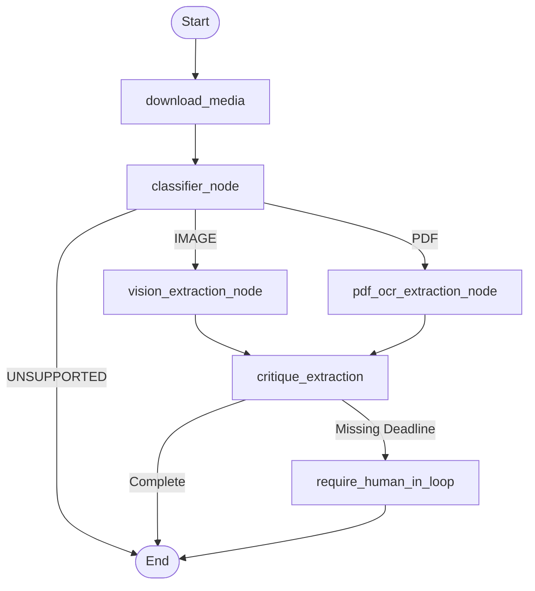

# Media Extractor Agent

The **Media Extractor** is a specialized LangGraph-based agent responsible for processing images and PDFs from the RabbitMQ `heavy_media_queue`. It relies on Gemini 2.0 Flash (Vision) and PyMuPDF to extract actionable tasks and deadlines from unstructured visual and document data.

## Agent Architecture Flow

When a user posts an image or PDF in Telegram (optionally with a caption containing a triage keyword), the API Gateway routes it here.

## Node Details

1. **`download_media`**: Connects to the Telegram Bot API to fetch the physical file using the `file_id` provided in the webhook payload.
2. **`classifier_node`**: Determines whether the file is an image (`.jpg`, `.png`) or a document (`.pdf`).
3. **`vision_extraction_node`**: Passes the image directly to Gemini Vision, asking it to identify schedules, syllabi deadlines, or whiteboard notes.
4. **`pdf_ocr_extraction_node`**: Uses PyMuPDF to extract text from the document, then feeds chunks to the LLM to locate deadlines hidden within multi-page documents.
5. **`critique_extraction`**: A validation step similar to the Text Extractor, ensuring that a deadline is present.
6. **`require_human_in_loop`**: If the critic determines a deadline is missing, the state is cached in Redis and a DM is sent to the user asking for clarification.
