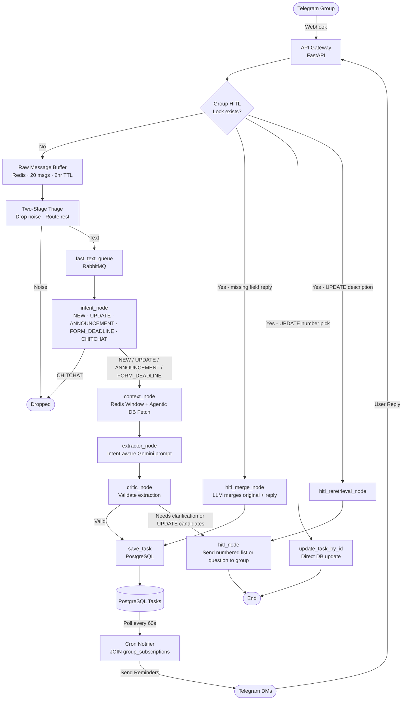

# Text Extractor Agent

The **Text Extractor** is a specialized LangGraph-based agent responsible for processing textual messages from the RabbitMQ `fast_text_queue`. It uses Google Gemini 2.5 Flash to classify intent, fetch conversational context, and extract actionable event data (deadlines, announcements, venue changes, etc.).

## Agent Architecture Flow

The agent runs through a state graph to determine exactly how a message should be handled.

## Node Details

1. **`classify_intent`**: Initial zero-shot classification to determine the nature of the message (e.g., NEW task, UPDATE to existing task, CHITCHAT to ignore).
2. **`fetch_context_agentic`**: Queries the PostgreSQL database for recent tasks if context is needed (e.g., when a user says "Update the OS assignment to tomorrow").
3. **`hitl_update_confirmation`**: If multiple matching tasks are found during an update, it triggers a Human-in-the-Loop flow to ask the user which task they meant.
4. **`extract_event_data`**: The core extraction LLM call that parses dates (automatically adjusting IST to UTC), locations, and action items.
5. **`critique_extraction`**: A validation step that ensures critical fields (like deadlines for NEW tasks) are actually present.
6. **`require_human_in_loop`**: If the critic finds the extraction lacking, it suspends the graph, caches the state in Redis, and sends a Telegram DM asking the user for the missing information.
7. **Specialized Nodes**:
   - `handle_venue_change`: Extracts and updates just the location of an existing event.
   - `handle_schedule_change`: Extracts and updates the time of an existing event.
   - `handle_announcement`: Processes general info blasts without deadlines.
